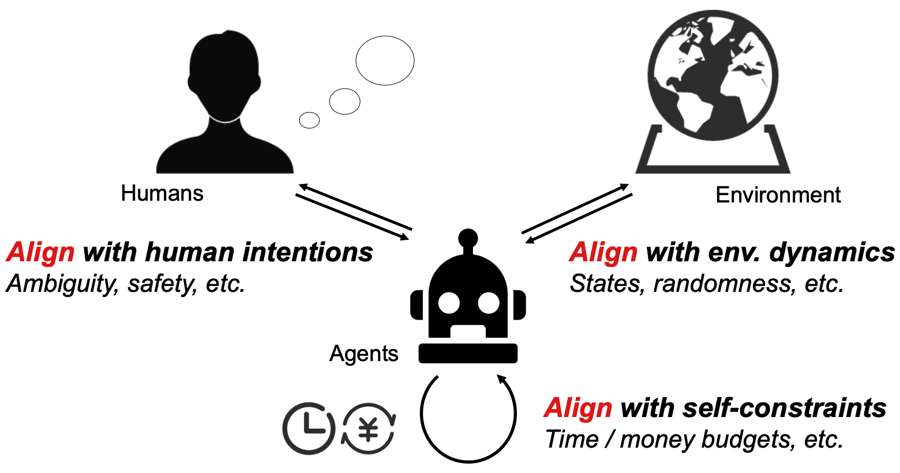
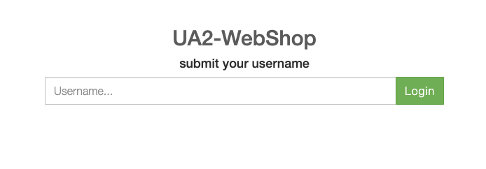
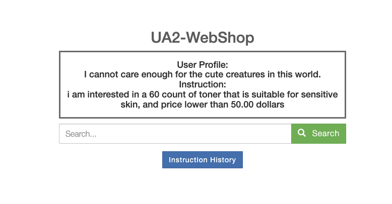

# UA2-WebShop

This repo contains the implementation of UA2-WebShop, the retrofitted WebShop environment proposed in [Towards Unified Alignment Between Agents, Humans, and Environment](https://arxiv.org/pdf/2402.07744.pdf). Based on the original [WebShop](https://webshop-pnlp.github.io/) environment, UA2-WebShop implements a testbed for agents to align with human intentions, environmental dynamics, and self-constraints simultaneously. 

<div style="text-align:center;">
    
</div>

An online demo of the environment can be accessed [here](http://49.232.144.86:5000/).

If you find this work useful in your research, please cite:

```
@article{yang2024towards,
   title = {Towards Unified Alignment Between Agents, Humans, and Environment},
   author = {Yang, Zonghan and Liu, An and Liu, Zijun and Liu, Kaiming and Xiong, Fangzhou and Wang, Yile and Yang, Zeyuan and Hu, Qingyuan and Chen, Xinrui and Zhang, Zhenhe and Luo, Fuwen and Guo, Zhicheng and Li, Peng and Liu, Yang},
   journal={arXiv preprint arXiv:2402.07744},
   year = {2024}
}
```

## Table of Contents <!-- omit in toc -->
* [Overview](#-overview)
* [Setup](#-setup)
* [Usage](#-usage)
* [Authors](#-authors)
* [Contributions](#-contributions)

## Overview

UA2-WebShop consists of 10 human user profiles, each of which is followed with an instruction group of 50 consecutive shopping assistance tasks. Constructed upon the [WebShop](https://webshop-pnlp.github.io/) environment, UA2-WebShop inherits the original 1.18 million real-world products. In the UA2-WebShop environment, an LLM-powered agent needs to analyze the user's initial profile, tracking and inferring a series of shopping instructions. In UA2-WebShop, two types of reranking mechanisms are implemented, including DPP based and collaborative filtering based reranking, As a result, in this environment, the agent needs to cope with changeable ranks of searched item lists as well. 

UA2-WebShop is a reflection of two lines of alignment covered in the position [paper](https://arxiv.org/pdf/2402.07744.pdf): ***alignment with human intentions*** and ***alignment with environmental dynamics***. The third line of alignment, ***alignment with self-constraints***, is tracked and computed in the runtime environment, the implementation of which can be found in the sibling [repo](https://github.com/AgentForceTeamOfficial/UA2-Agent).

## Setup

The setup of UA2-WebShop follows [the setup of the original WebShop](https://github.com/princeton-nlp/WebShop?tab=readme-ov-file#-setup). After the installation of required packages and the preparation of original data, download the data for UA2-WebShop and put them in the `data` directory.

The data for UA2-WebShop can be downloaded [here](https://cloud.tsinghua.edu.cn/d/93445be4c5eb41f2aacf/):

- `new_tasks_ins_v4.json` consists of the constructed new tasks: 10 human user profiles in total, each of which is followed with an instruction group of 50 consecutive tasks.
- `items_id2idx.json` indicates the index of each shopping item.
- `embeddings` folder contains the embedding vectors for each items pre-computed with a LLama-2 13b base model. The embedding data is used in the DPP-based reranking mechanism (described in this [paper](https://arxiv.org/abs/1709.05135)).
- `prime_user_score.json` stores the preference weights of 'other users' (simulated by ChatGPT role playing) for collaborative filtering based reranking.

## Usage
The UA2-WebShop environment is deployed in the `html` mode. Launch the `UA2-WebShop` webpage:
```sh
> ./run_prod.sh
```
The site should then be viewable in the browser at http://localhost:5000/. As different users need to be differentiated for the individual tracking of the clicking history, the landing page requires inputting username http://localhost:5000/login :

   <div style="text-align:center;">
      
   </div>

One needs to enter a unique username to arrive at the task page http://localhost:5000/user_0/task_0: 

   <div style="text-align:center;">
      
   </div>

After entering the username, the name is kept in the session for the identification of an individual user. The name will be dropped once the session is over or the browser cache is reset.

Flags (*e.g.*, `--log`, `--attrs`) are inherited from the original WebShop. UA2-WebShop introduces the following new flag:
* `--rerank`: Include this flag to enable reranking (a weighted average effect of the two reranking algorithms) in UA2-WebShop. The balancing weight is set to be 0.8 for collaborative filtering and 0.2 for DPP - This is the setting used in our paper, and can be altered in the 439-th line of `web_agent_site/engine/engine.py`.

## Authors 

<div>
    <span style="vertical-align: middle">The UA2-WebShop project is a collaborative effort of</span>  <span style="vertical-align: middle"><b>AgentForce Team</b>. The task design and the environment construction of UA2-WebShop is initiated and led by <a href="https://minicheshire.github.io">Zonghan Yang</a> (<a href="mailto: yangzh20@mails.tsinghua.edu.cn">yangzh20@mails.tsinghua.edu.cn</a>). The following members are listed in alphabetical order, with main contributions listed:</span> 
</div>

- [Xinrui Chen](https://github.com/CXR321) implemented the novel pages in UA2-WebShop (esp. the user login mechanism), and was also in charge of data gathering and processing of the simulated preferences.
- [Yile Wang](https://github.com/ylwangy) led and implemented the ChatGPT role-playing part to gather simulated preference data for collaborative filtering.
- [Fangzhou Xiong](https://github.com/XiongFangzhou) implemented both the DPP-based and the collaborative filtering based reranking mechanisms. 
- [Zhenhe Zhang](https://github.com/zzh2021010869) processed the simulated preference data, and was also in charge of the response behavior of the website in terms of time delays.
- [Kaiming Liu](https://github.com/KMing-L), [Zeyuan Yang](https://github.com/MiicheYang), as well as all the aforementioned members contributed to the validity checks of task construction in UA2-WebShop.
- [Zhicheng Guo](https://github.com/zhichengg), [Qingyuan Hu](https://github.com/HQY188), [An Liu](https://github.com/xxmlala), [Zijun Liu](https://github.com/BBQGOD), and [Kaiming Liu](https://github.com/KMing-L) validated and provided feedbacks from the perspective of LLM-powered agent baselines implementation.
- Chi Chen, Fuwen Luo, Ziyue Wang, Siyu Wang, and Xiaolong Wang contributed to the human evaluation of ChatGPT-simulated preference data.

The project is advised by [Peng Li](https://www.lpeng.net/) (lipeng@air.tsinghua.edu.cn) and [Yang Liu](https://nlp.csai.tsinghua.edu.cn/~ly) (liuyang2011@tsinghua.edu.cn), and is heavily inspired by the original [WebShop](https://webshop-pnlp.github.io/) environment.

## Contributions

We look forward to all kinds of suggestions from anyone interested in our project with whatever backgrounds! Either PRs, issues, or leaving a message is welcomed. We'll be sure to follow up shortly!
